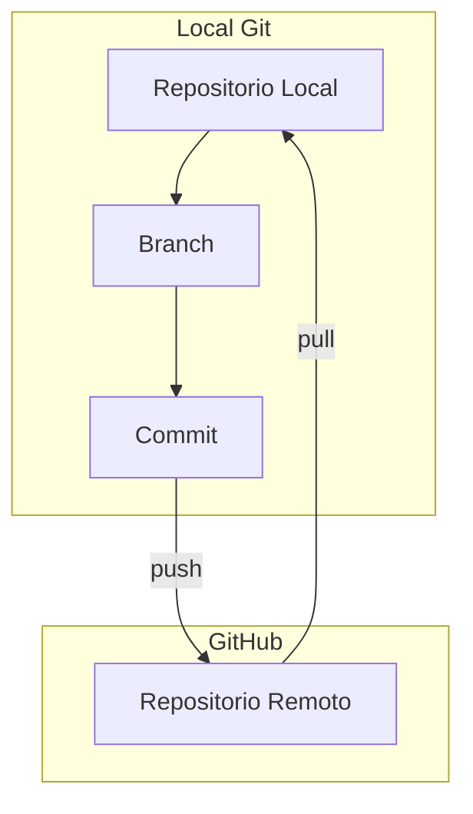

# uba-m71v-7-taller
Clase 8

Esto es un archivo README.md

# Git y GitHub - Explicación Básica

```mermaid
flowchart TD
    subgraph Local[Local Git]
        A[Repositorio Local]
        B[Branch]
        C[Commit]
    end

    subgraph Remote[GitHub]
        D[Repositorio Remoto]
    end

    A --> B
    B --> C
    C -->|push| D
    D -->|pull| A
```